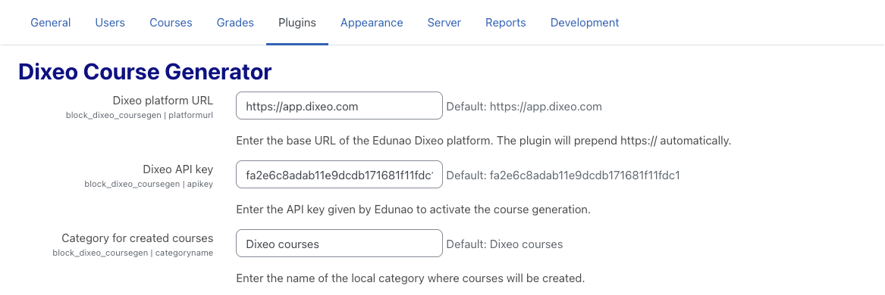
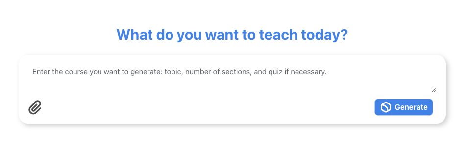

# Dixeo Course Generator for Moodle LMS

Effortlessly create complete Moodle courses using the power of AI. The **Dixeo Course Generator** helps administrators and educators turn a simple course description and optional supporting files into a fully functional, ready-to-use Moodle course in just a few clicks.

This plugin generates your course on Dixeo.com and automatically configures your Moodle platform to access it via LTI.

You can also create a [free Dixeo account](https://dixeo.com/login/signup.php) to start building courses directly.

---

## 🚀 Features

- **AI-Powered Course Generation**  
  Automatically generate structured courses based on a short description.

- **File Upload Support**  
  Enrich the course generation by uploading relevant source files (e.g., PDFs, docs).

- **Automatic LTI Module Integration**  
  The plugin sets up LTI modules for seamless access to the generated content.

- **Multi-language Support**  
  Available in **English**, **French**, **Spanish**, and **Italian**.

---

## ⚙️ Installation

1. Download the plugin ZIP file.
2. Extract and place the folder named `dixeo_coursegen` into the `/blocks` directory of your Moodle installation.
3. Log in to your Moodle site as an administrator.
4. Navigate to **Site administration** — Moodle will detect the new plugin and walk you through the installation steps.

---

## 🔧 Configuration

1. Go to **Site administration** > **Plugins** > **Blocks** > **Dixeo Course Generator**.
2. Enter the **API key** provided by Dixeo.
3. Specify the **default category name** where generated courses will be created.
4. Ensure the **LTI enrolment method** is enabled on your Moodle platform.

---

## 🧑‍🏫 How to Use

1. Add the **Dixeo Course Generator** block to your Moodle dashboard or course page.
2. Provide a **course description** in the input box.
3. *(Optional)* Upload any supporting documents to enhance content generation.
4. Click the **Generate** button.
5. Wait a few moments for the course to be created.
6. A **success message** will appear with a link to the newly generated course.

---

## 🔐 Permissions

Ensure that users have the `moodle/course:create` capability to access and use the plugin features.

---

## 🆘 Support

For assistance, questions, or further information, please contact **contact@dixeo.com** or refer to the official plugin documentation.

---

*Created and maintained by [Dixeo](https://www.dixeo.com/)*
